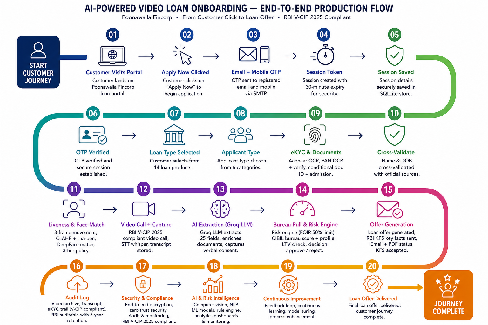

<p align="center">
  
</p>

<h1 align="center">🏦 AI-Powered Video Loan Onboarding System</h1>

<p align="center">
  <strong>TenzorX 2026 — National AI Hackathon by Poonawalla Fincorp</strong>
</p>

<p align="center">
  
  
  
  
  
</p>

---

## Problem Statement

Traditional loan onboarding requires physical branch visits, manual document submission, and days of processing. This system transforms the entire journey into a **100% digital, AI-powered experience** — from identity verification to a personalised loan offer — in under 5 minutes, fully compliant with RBI Digital Lending Directions 2025 and Video Customer Identification Process (V-CIP) guidelines.

---

## Key Features

| Feature | Technology | Description |
|---------|-----------|-------------|
| Video KYC | Web Speech API + Whisper STT | RBI V-CIP compliant — live word-by-word transcription and accurate full recording |
| Face Verification | DeepFace Facenet512 + CLAHE | 3-tier policy (Pass / Manual Review / Fail), South Asian bias-corrected age estimation |
| Document OCR | Groq Vision (llama-4-scout) | Aadhaar, PAN and 5 conditional docs (employee ID, student ID, admission letter, professional cert, business reg) |
| AI Extraction | Groq LLM (llama-3.3-70b) | 25-field structured extraction from natural speech — Indian number patterns, verbal consent detection |
| Risk Engine | Rule-based + CIBIL simulation | FOIR 50% RBI cap, LTV tiers (Gold RBI 2025, LAP), co-applicant income for education loans |
| RBI KFS | Python templating | Mandatory Key Facts Statement with APR disclosure using Newton-Raphson method |
| Email OTP Auth | Gmail SMTP | Branded OTP emails with 10-min expiry — screen fallback when SMTP not configured |
| Save and Resume | localStorage + SQLite | 7-day session persistence — resume from any step |
| AI Chatbot | Groq LLM | Floating loan advisor — anti-hallucination system prompt, knows all 14 loan products |
| Audit Trail | SQLite | Tamper-proof compliance log — every event timestamped and RBI-auditable |
| Application Summary | HTML to PDF | Branded summary auto-emailed on KFS acceptance |
| Refer and Earn | React SPA | Full referral programme matching Poonawalla Fincorp's actual rewards scheme |

---

## Application Flow (11 Screens)

```
1. Landing  →  2. Loan Type (14 products)  →  3. KYC Docs  →  4. Liveness Check
→  5. Face Match (3-tier)  →  6. Video Call (AI transcript)  →  7. Review (LLM extraction)
→  8. Risk Assessment (FOIR + CIBIL + LTV)  →  9. KFS  →  10. Audit Trail  →  11. Summary PDF
```

<p align="center">
  
</p>

---

## Screenshots

<p align="center">
  
  &nbsp;&nbsp;
  
</p>

---

## Setup Guide — Step by Step

### Step 0: What You Need Before Starting

| Requirement | How to Get | Without It |
|-------------|-----------|------------|
| **Groq API Key** | console.groq.com — free | AI extraction, OCR, chatbot all fail with 500 error |
| **Gmail App Password** | See Step 2 below | OTP shows on screen instead of email — app still works |
| **Tesseract OCR** | https://github.com/UB-Mannheim/tesseract/wiki | Document OCR fallback fails |
| **Poppler** | https://github.com/oschwartz10612/poppler-windows/releases | PDF document upload fails |
| Python 3.11+ | https://python.org | Backend won't start |
| Node.js 18+ | https://nodejs.org | Frontend won't start |

---

### Step 1: Get Your Groq API Key (Free — takes 2 minutes)

**This is the most critical step. Without Groq, the entire AI pipeline fails.**

1. Go to https://console.groq.com
2. Click Sign Up (or Log In)
3. Go to **API Keys** in the left sidebar
4. Click **Create API Key** — name it anything
5. Copy the key — it starts with `gsk_`
6. Paste it as `GROQ_API_KEY` in `backend/.env` (see Step 3)

---

### Step 2: Get Gmail App Password for OTP Emails (Optional but recommended)

**If you skip this step:** The OTP is printed to the backend console AND shown directly on the login screen in an orange highlighted box labelled `Demo OTP: xxxxxx`. The app works perfectly — the judge can read and use this code without needing email access.

**If you set it up:** OTP is sent silently to the email the applicant enters on the login screen.

Steps to get App Password:

1. Go to https://myaccount.google.com
2. Click **Security** in the left sidebar
3. Make sure **2-Step Verification** is turned ON
4. In the search bar at the top of the page, search **App Passwords**
5. In the app name field, type `Poonawalla OTP` and click Create
6. Google shows a 16-character password like `abcd efgh ijkl mnop` — copy it exactly (spaces are fine)
7. Paste it as `SMTP_PASSWORD` in `backend/.env`

---

### Step 3: Configure backend/.env

```bash
cd loan-onboarding/backend
copy .env.example .env
```

Open `.env` in any text editor and fill in your values:

```
GROQ_API_KEY=gsk_your_actual_key_here
SECRET_KEY=any-random-string-at-least-32-characters
ENVIRONMENT=development
WHISPER_MODEL=base
TF_ENABLE_ONEDNN_OPTS=0

# Optional — without these, OTP shows on screen (app still works)
SMTP_EMAIL=your.gmail@gmail.com
SMTP_PASSWORD=xxxx xxxx xxxx xxxx

# Windows only
TESSERACT_PATH=C:\Program Files\Tesseract-OCR\tesseract.exe
POPPLER_PATH=C:\poppler\Library\bin
```

---

### Step 4: Start the Backend

```bash
cd backend
python -m venv venv
venv\Scripts\activate
pip install -r requirements.txt
python -m uvicorn main:app --reload --port 8000
```

You should see: `[Face] Facenet512 preloaded — face match will be fast`

---

### Step 5: Start the Frontend (open a new terminal)

```bash
cd frontend
npm install
npm start
```

Browser opens automatically at http://localhost:3000

---

### Step 6: Verify Everything Works

| Check | URL | Expected |
|-------|-----|----------|
| Frontend | http://localhost:3000 | Landing page with loan cards |
| Backend health | http://localhost:8000/health | Returns status ok |
| API docs | http://localhost:8000/docs | Swagger UI |

---

### OTP Behaviour — Important for Judges

| SMTP configured? | OTP | Loan confirmation email |
|-----------------|-----|------------------------|
| ✅ Yes | Sent to the email entered on login screen — check inbox and spam | ✅ Sent automatically after KFS acceptance |
| ❌ No | **Printed in the backend terminal/console** — look for a line like `[OTP] Session: xxxx  OTP: 123456` and type it in the app | ❌ Not sent — app logs `SMTP not configured` but continues normally |

> **For judges running without SMTP:** After clicking "Get OTP", switch to the backend terminal window. You will see the OTP printed clearly between `===` lines. Enter it in the app. Everything else works identically.

---

## Docker Deployment

```bash
docker-compose up --build -d
docker-compose logs -f
docker-compose down
```

Backend: http://localhost:8000  
Frontend: http://localhost:3000

First Docker build takes 5 to 10 minutes — it downloads Whisper and DeepFace model weights. Subsequent builds are fast due to cached layers.

---

## Architecture

```
┌──────────────────────────────────────────────────────┐
│                   React 18 Frontend                   │
│         11-screen SPA · Nginx · Port 3000             │
└────────────────────────┬─────────────────────────────┘
                         │  REST API
┌────────────────────────▼─────────────────────────────┐
│                  FastAPI Backend                      │
│               Python 3.11 · Port 8000                │
├──────────────┬──────────────┬──────────┬─────────────┤
│   Routes     │   Services   │  Models  │   Infra     │
│  session.py  │ face_svc     │database  │ SQLite DB   │
│  kyc.py      │ llm_svc      │          │ Gmail SMTP  │
│  loan.py     │ stt_svc      │          │ Docker vol  │
│  refer.py    │ risk_engine  │          │             │
│              │ bureau_svc   │          │             │
│              │ document_svc │          │             │
│              │ kfs_svc      │          │             │
│              │ summary_svc  │          │             │
└──────────────┴──────────────┴──────────┴─────────────┘
                         │
┌────────────────────────▼─────────────────────────────┐
│               External Services                      │
│  Groq API (LLM + Vision) · Gmail SMTP · CIBIL (sim)  │
└──────────────────────────────────────────────────────┘
```

---

## Project Structure

```
loan-onboarding/
├── backend/
│   ├── models/database.py
│   ├── routes/session.py, kyc.py, loan.py, refer.py
│   ├── services/face, llm, stt, risk, bureau, document, kfs, summary
│   ├── main.py
│   ├── requirements.txt
│   ├── .env.example
│   └── Dockerfile
├── frontend/
│   ├── public/images/
│   ├── src/App.jsx
│   ├── nginx.conf
│   └── Dockerfile
├── docs/
├── docker-compose.yml
├── .gitignore
└── README.md
```

---

## Supported Loan Products (14 Types)

| Loan | Rate | Max Amount |
|------|------|-----------|
| Personal Loan | 9.99%+ | 30 Lakh |
| Business Loan | 15%+ | 50 Lakh |
| Professional Loan | 13%+ | 75 Lakh |
| Home Loan | 9.55%+ (Women 8.75%) | No cap |
| Education Loan Domestic | 10%+ | 20 Lakh |
| Education Loan International | 10.5%+ | 50 Lakh |
| Loan Against Property | 9%+ | 10 Crore |
| Gold Loan | 9.99%+ | 85% LTV RBI 2025 |
| Pre-Owned Car | 12%+ | 75 Lakh |
| Medical Equipment | 9.99%+ | 10 Crore |
| Consumer Durable | 0 to 9% | 5 Lakh |
| Instant Personal | 9.99%+ | 5 Lakh |

---

## RBI Compliance Features

- Video Customer Identification Process V-CIP per RBI Digital Lending Directions 2025
- FOIR 50% hard limit enforced in risk engine
- RBI Key Facts Statement KFS with APR disclosure before acceptance
- Verbal consent captured and stored in audit trail
- Gold loan LTV tiers per RBI 2025 circular
- Education loan collateral rules per RBI guidelines
- Full tamper-proof audit trail — every decision is explainable and queryable

---

Built with love for **TenzorX 2026 — National AI Hackathon** by Poonawalla Fincorp.
